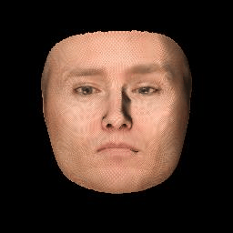

# Face_3DMM : A python tool to play with 3DMM

## Introduction


This project implements some basic functions related to face morphable model (3DMM in this project).

This project can do but is not limited to ths following tasks:
* Generating 3D face from 3DMM.
* Rendering face images from 3D mesh with different external parameter or lightings. 
* Rendering UV map 

## Structure

```
Render is the main part to process 3D mesh
Render /   #This part is written in python && c++
| cython /   #c++ In order to speed up rendering
| Render.py   #
| Zbuffer.py  # Render.py and Zbuffer.py is used to render images from 3D mesh
| Projection.py # Process 3D mesh using orthogonal projection
| light.py       # Adding different lighting conditions 

example is some examples of use
example /
| data # 3DMM data and output
| utils.py # some read / write file functions
| one_generate_image.py # generate different shape  or expression faces images
| two_change_rt.py # generate face images with different external parameter
| three_change_light.py # generate face images with different lighting conditions
| four_uv.py #generate face uv_map
```
## Examples

`cd example`

* `python one_generate_image.py`

Generating a face  from 3DMM with randomly shape,expression and texture


* `python two_change_rt.py`

Generate a face that rotates around the y axis


* `python three_change_light.py`

Generate a face with different lighting position.



* `four_uv.py`

Generate a uv_map (left raw image,right uv map) 


## Getting start

Rendering face images from 3D mesh can be implemented with python, but it's too slow.
So i use cython to accelerate it.

### Usgage
* clone the repository
 ```
git clone https://github.com/txycircle/face_3dmm
cd 3DMM_render
```
*  Compile c++ files
```
cd Render/cython
python setup.py build_ext -i 
```
* Run examples
